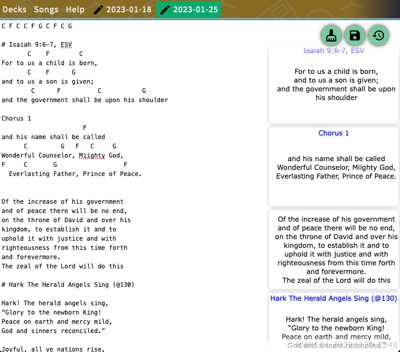

# Slides

This is a **simple** slide deck builder and presenter, focused on song lyrics.

It's specially useful for using remotely with Zoom or OBS, since the presenter
and screen may be on different computers/networks.

## Editor view

Click on a date on the calendar to bring up the editor for that slide deck.
Text is converted into slides, which are shown in a preview area at the right.
One or more empty lines start a new slide, Markdown-style.

Lines that start with "#", or that look like
song section names ("intro", "chorus", "verse", etc) are converted to titles.
Chords and markings such as "(2x)" are automagically ignored.
Usually, pasting lyrics with chords mixed in Just Works™️.

Clicking a slide on the preview area will set that as the current
content of the screen. Clicking on "clear screen" will clear it.



## Screen view

The screen view will be updated with the current content.
It's possible to use screens and decks independently, and different
users can open the same deck and control its screen simultaneously.

For instance, user A can use change the current slide on the editor,
and user B viewing a screen on a different network
will see the change instantly. There's no collaborative editing though.


### Building/running

Build it and create a `config.yaml`, containing the address to serve on,
the base URL, and paths to the db and log files.

```
address: localhost:8080
baseurl: //localhost:8080
path:
  log: /path/to/slides.log
  db: /path/to/slides.sqlite3
```

Running it with `-dev` will disable cache for static resources,
and reload them on each pageview. All static files are embedded in the
binary, so there's no need to copy anything else to the server.
